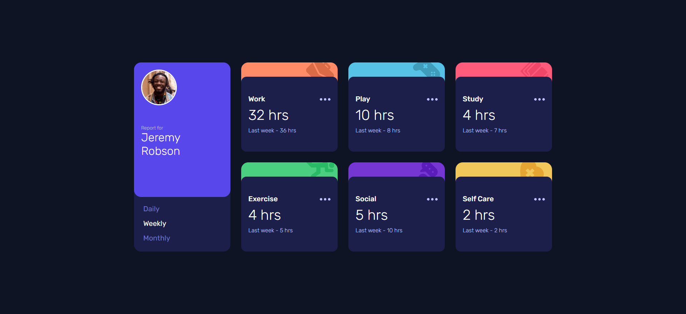

# Frontend Mentor - Time tracking dashboard solution

This is a solution to the [Time tracking dashboard challenge on Frontend Mentor](https://www.frontendmentor.io/challenges/time-tracking-dashboard-UIQ7167Jw). Frontend Mentor challenges help you improve your coding skills by building realistic projects. 

## Table of contents

- [Overview](#overview)
  - [The challenge](#the-challenge)
  - [Screenshot](#screenshot)
  - [Links](#links)
- [My process](#my-process)
  - [Built with](#built-with)
  - [What I learned](#what-i-learned)
  - [Continued development](#continued-development)
  - [Useful resources](#useful-resources)
- [Author](#author)
- [Acknowledgments](#acknowledgments)

## Overview

### The challenge

Users should be able to:

- View the optimal layout for the site depending on their device's screen size
- See hover states for all interactive elements on the page
- Switch between viewing Daily, Weekly, and Monthly stats

### Screenshot

### Links

- Live Site URL: [https://mighty-tor-23888.herokuapp.com/](https://mighty-tor-23888.herokuapp.com/)

## My process

### Built with

- Semantic HTML5 markup
- CSS custom properties
- Flexbox
- CSS Grid
- SASS
- Mobile-first workflow
- [Node.js](https://nodejs.org/en/) - Node.js runtime
- [Express.js](https://expressjs.com/) - Node.js framework
- [JSON](https://www.json.org/json-en.html) - Data import from web

## Author

- Website - [LinkedIn](https://www.linkedin.com/in/zydrunasrimkus/)
- Frontend Mentor - [@zydrunasrimkus](https://www.frontendmentor.io/profile/zydrunasrimkus)